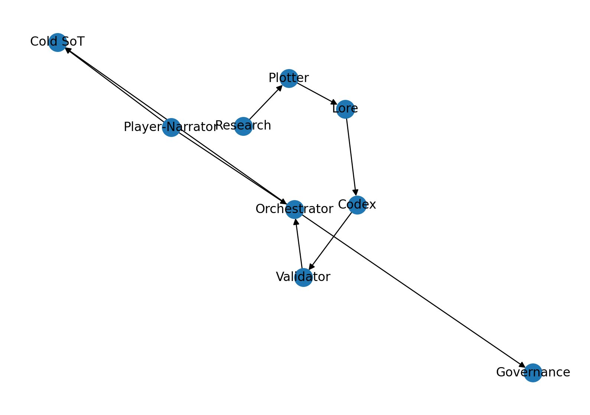

# Questfoundry — A Creative Operating System

**What it is:** a layered, reproducible studio for narrative, art, and audio.  
**Hot SoT:** message bus for live cycles. **Cold SoT:** project files for canon.  
**Player‑Narrator (PN):** deterministic, release (default), debug.

## Quickstart (stub)

```bash
python tools/quickstart_runner.py
```

Language → genre → tweak settings → silent build (teasers) → project zip offered → PN play.

See `reference/architecture.md`, `reference/options_and_configs.md`, and `protocol/README.md`.  


## Release Process

Push a tag matching `v*` from your main branch to trigger the release workflow (for example, `git tag v0.1.0 && git push origin v0.1.0`). Automation publishes release notes on GitHub and attaches a ZIP snapshot of the specification.

## Development

- Run `python tools/build_schema_artifacts.py` to regenerate the bundled schema and reference diagrams in `protocol/dist/`.
- Optional: `pre-commit install` to run the generator automatically before each commit.
